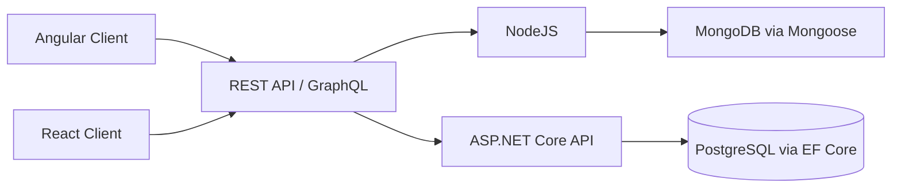

# reactrack

**Hub full-stack multi-stack** — um monorepo que reúne vários produtos de interface, duas APIs de backend e um contrato de autenticação compartilhado, pensado para demonstrar domínio de arquitetura, testes e entrega em produção.

[](https://render.com)


Ecossistema open source para desenvolvimento full-stack com stacks interoperáveis: **React + Node.js**, **Angular + Node.js**, **React + ASP.NET Core** e **Angular + ASP.NET Core**.

---

## 📚 Índice

- [Demo em produção (Render)](#demo-em-produção-render)
- [Início rápido — cliente React](#início-rápido--cliente-react)
- [Visão Geral](#visão-geral)
- [Arquitetura Multi-Stack](#arquitetura-multi-stack)
- [Diagrama de Arquitetura](#diagrama-de-arquitetura)
- [Estrutura do Repositório](#estrutura-do-repositório)
- [Backend Node.js (Express + TypeScript)](#backend-nodejs-express--typescript)
- [Backend C# (.NET + PostgreSQL)](#backend-c-net--postgresql)
- [Frontends (React e Angular)](#frontends-react-e-angular)
- [Rotas e Interfaces de API](#rotas-e-interfaces-de-api)
- [Variáveis de Ambiente](#variáveis-de-ambiente)
- [Docker e Orquestração Local](#docker-e-orquestração-local)
- [Scripts](#scripts)
- [Galeria UI/UX dos Sistemas](#galeria-uiux-dos-sistemas)
- [Architecture Decision Record (ADR) Simplificado](#architecture-decision-record-adr-simplified)
- [Contribuições](#contribuições)

<hr>

## ☁️ Demo em produção (Render)

O frontend (e o pipeline associado) está **publicado no Render** — plataforma que conecta o repositório ao deploy contínuo, com HTTPS e variáveis de ambiente gerenciadas. Isso permite validar o produto em um URL público, alinhado ao que times de engenharia esperam ver em um portfólio sênior.

- **Plataforma:** [Render](https://render.com) (PaaS)
- **Benefício:** demo acessível, logs e rebuilds a partir do Git — útil para apresentar o projeto em processos seletivos sem depender da sua máquina.

**URL da demo (Render):** https://reactrack-server.onrender.com/.

<hr>

## ⚡ Início rápido — cliente React

Na raiz do repositório:

```bash
cd client
npm install
```

| Objetivo | Comando |
|----------|---------|
| Servidor de desenvolvimento (Vite, todas as interfaces) | `npm run dev` |
| Build de produção (TypeScript + Vite) | `npm run build` |
| Pré-visualizar o build localmente | `npm run preview` |
| Lint (ESLint) | `npm run lint` |
| Testes (Vitest) | `npm run test` |

O Vite sobe em **`http://localhost:5173`** (com `--host 0.0.0.0` para acesso na rede local). Configure `client/.env` ou `client/.env.local` com `VITE_BACKEND_URL` apontando para a API que você estiver usando.

<hr>

## 🌐 Visão Geral

O `reactrack` foi organizado como um hub de sistemas front-end com uma camada de autenticação e dados compartilhada. A arquitetura suporta:

- Backend Node.js com `Express`, `TypeScript`, `Mongoose`, `JWT`, `bcryptjs`, `Nodemailer/Brevo`.
- Backend C# com `ASP.NET Core`, `EF Core`, `Npgsql`, `JWT`, `System.Net.Mail`.
- Frontend React (`client`) e frontend Angular (`client-angular`) consumindo a mesma superfície de API de autenticação e dados de usuário.
- Camada GraphQL no backend Node para consultas flexíveis via Apollo Server.

<hr>

## 🏗️ Arquitetura Multi-Stack

| Stack | Runtime | ORM/ODM | Auth | Email |
|---|---|---|---|---|
| Node.js + Express | TypeScript | Mongoose (MongoDB) | JWT + bcryptjs | Nodemailer/Brevo |
| C# + ASP.NET Core | .NET 8 | Entity Framework (PostgreSQL) | JWT (Issuer/Audience + assinatura simétrica) | System.Net.Mail |
| Angular (frontend alternativo) | TypeScript | - | Consome mesma API JWT/cookie HTTP-only | - |

### Compatibilidade de consumo de API

- `client` (React) e `client-angular` compartilham o mesmo contrato de autenticação (`register`, `login`, `logout`, `verify`, `reset`, `userData`).
- O backend C# foi estruturado para manter semântica de autenticação por JWT em cookie (`token`) e fluxo de verificação/reset equivalente ao backend Node.
- Essa topologia permite comparar ou migrar stack de backend sem reescrever a camada de UX.

<hr>

## 🧭 Diagrama de Arquitetura



<hr>

## 🗂️ Estrutura do Repositório

```txt
reactrack/
|- client/                 # Frontend React + TypeScript + Vite
|- client-angular/         # Frontend Angular alternativo
|- server/                 # Backend Node.js + Express + GraphQL
|- server-csharp/
|  |- Communication/       # Contratos e DTOs de requests/responses
|  |- Exceptions/          # Exceções de domínio e HTTP mappings
|  |- ReactRack/           # API ASP.NET Core
|- docker-compose.yml      # Orquestração local multi-stack
|- ui-ux/                  # Referências visuais e screenshots
```

<hr>

## ⚙️ Backend Node.js (Express + TypeScript)

### Camadas e responsabilidades

| Pasta | Responsabilidade técnica |
|---|---|
| `server/config` | Inicialização de conexão MongoDB via Mongoose (`connected`, `disconnected`, `error`). |
| `server/controllers` | Casos HTTP para `auth` e `user`, com assinatura de cookie JWT, validações e integrações SMTP. |
| `server/middleware` | Middleware principal de autenticação JWT com dados de usuário em `res.locals`. |
| `server/middlewares` | Middlewares secundários de organização do framework Melt. |
| `server/routes` | Composição de rotas Express (`auth`, `user`, `home`, `error`). |
| `server/graphql` | Camada Apollo com `context`, `dataSources`, `directives`, `resolvers`, `schema/types`, `schema/models`. |
| `server/templates` | Templates de email + transporter Brevo/Nodemailer. |
| `server/tests` | Testes automatizados (`Mocha`, `Chai`, `Sinon`) com suíte reportada de 35 passing. |
| `server/json` | Fontes JSON para sistemas auxiliares (`convene`, `opinly`) executados por `concurrently`. |
| `server/views` | Páginas HTML SSR de home/documentação e fallback de erro. |

### Entrypoints e build

- `server.ts`: bootstrap do Express, conexão de banco, integração GraphQL e start da API.
- `app.ts`: instância da aplicação, CORS, prevenção de CSRF e registro de middlewares/rotas.
- `tsup.config.ts`: bundle do servidor (`build-server`) com cópia de assets (`public`, `views`, `graphql`).

<hr>

### Rotas REST Node

| Arquivo | Endpoints principais |
|---|---|
| `server/routes/auth.ts` | `/api/auth/register`, `/api/auth/login`, `/api/auth/logout`, `/api/auth/forgot-password` + fluxos OTP/verify |
| `server/routes/user.ts` | `/api/user/data` (protegida) |
| `server/routes/home.ts` | `/` (home/documentação da API) |
| `server/routes/error.ts` | `*` fallback 404 |

<hr>

## 🧩 Backend C# (.NET + PostgreSQL)

### Estrutura técnica

| Módulo | Papel arquitetural |
|---|---|
| `@Communication/@Requests` | Contratos de entrada tipados com sealed records para Login, Register, ResetPassword, SendResetOtp, ValidateResetOtp, VerifyAccount. |
| `@Communication/@Responses` | Contratos de saída tipados para respostas de API/Auth/UserData. |
| `@Controllers` | Controllers `Auth` e `User` para orquestração dos Use Cases. |
| `@Entities` | Entidade de usuário persistida pelo EF Core. |
| `@Filters` | Global Exception Filter para normalização de erros HTTP. |
| `@Infrastructure` | Camadas de Email, Middleware de logging, Persistence, Repositories, Security e Settings. |
| `@Repositories` | Abstrações de acesso a dados via interfaces. |
| `@Security` | Geração e validação de JWT (Issuer, Audience, SecretKey). |
| `@Settings` | Configurações tipadas para JWT e SMTP. |
| `@UseCases` | Casos de uso por domínio (`Auth`, `User`). |

### Padrões e decisões de engenharia

- Clean Architecture para separação entre entrada HTTP, domínio de aplicação e infraestrutura.
- Repository Pattern para desacoplamento de persistência.
- Dependency Injection nativa do ASP.NET Core para Use Cases, repositórios, serviços de token e email.
- Global Exception Filter para padronização de respostas de erro.

### `Program.cs` (pipeline e infraestrutura)

O bootstrap da API C# registra:

- `WebApplicationBuilder` + `DbContext` com `UseNpgsql`.
- Configuração de `JwtBearer` com validação de `Issuer`, `Audience`, `Lifetime` e `SigningKey`.
- Recuperação de JWT por cookie HTTP-only (`token`) em `OnMessageReceived`.
- `Swagger`/`SwaggerUI` em ambiente de desenvolvimento.
- Política CORS para `localhost:5173` (React) e `localhost:4200` (Angular).
- Logging de request/response via middleware dedicado.

### `appsettings.json`

Configurações chave já mapeadas:

- `Jwt`: `SecretKey`, `Issuer`, `Audience`.
- `ConnectionStrings:Postgres`: string para `UseNpgsql`.
- `Smtp`: `Host`, `Port`, `Username`, `Password`, `FromEmail`, `FromName`, `EnableSsl`.

### Use Cases implementados

- Domínio `Auth`: `Login`, `Register`, `ResetPassword`, `SendResetOtp`, `ValidateResetOtp`, `VerifyAccount` (inclui também envio de OTP de verificação).
- Domínio `User`: `GetData`.

<hr>

## 🖥️ Frontends (React e Angular)

### React (`client`)

- **Vite 7 + React 19 + TypeScript**, Tailwind 4, MUI, TanStack Query, React Router 7, Formik/Yup, i18next, Vitest.
- Camada `src/api` com funções para autenticação, verificação de conta, reset de senha e `userData`.
- Integração com contextos de domínio e múltiplos “sistemas” (módulos) na mesma SPA.

**Comandos:** veja a seção [Início rápido — cliente React](#início-rápido--cliente-react) e a tabela em [Scripts](#scripts) (`npm run dev`, `build`, `preview`, `lint`, `test`).

### Angular (`client-angular`)

- Frontend alternativo com Angular 21.
- Consome a mesma interface REST/JWT usada pelo cliente React.
- Compatível com autenticação por cookie HTTP-only nos backends Node e C#.
- Posicionado para times que adotam ecossistema Angular e DI nativa do framework.

<hr>

## 🔌 Rotas e Interfaces de API

### Fluxo de autenticação compartilhado

| Operação | Objetivo |
|---|---|
| `register` | Criação de conta e início de verificação |
| `login` | Emissão de JWT com persistência em cookie |
| `logout` | Revogação no cliente (remoção de sessão/cookie) |
| `sendVerifyOtp` / `verifyAccount` | Verificação de conta por OTP |
| `sendResetOtp` / `validateResetOtp` / `resetPassword` | Recuperação de senha com OTP |
| `userData` / `GetData` | Retorno de dados da conta autenticada |

### GraphQL (backend Node)

A camada GraphQL está organizada para consultas e mutações com:

- `context/buildContext`
- `dataSources/createDataSources`
- `directives/authDirectiveTransformer`
- `resolvers/mutations`, `resolvers/queries`, `resolvers/scalars`
- `schema/models`, `schema/types`

<hr>

## 🔐 Variáveis de Ambiente

### Node (`server/.env.local` ou `.env`)

```env
PORT=4000
MONGODB_URL=<mongodb-connection-string>
JWT_SECRET=<jwt-secret>
NODE_ENV=development
SMTP_USER=<smtp-user>
SMTP_PASS=<smtp-password>
SENDER_EMAIL=<sender-email>
```

### C# (`server-csharp/ReactRack/appsettings*.json` e overrides de env)

```json
{
  "Jwt": {
    "SecretKey": "<secret>",
    "Issuer": "ReactRack.Api",
    "Audience": "ReactRack.Client"
  },
  "ConnectionStrings": {
    "Postgres": "Host=localhost;Port=5432;Database=reactrack_db;Username=postgres;Password=123"
  },
  "Smtp": {
    "Host": "smtp-relay.brevo.com",
    "Port": 587
  }
}
```

<hr>

## 🐳 Docker e Orquestração Local

O `docker-compose.yml` suporta execução simultânea de:

- `server` (Node/Express) em `http://localhost:4000`
- `client` (React/Vite) em `http://localhost:5173`
- `server-csharp` (.NET) em `http://localhost:5000`
- `client-angular` (Angular) em `http://localhost:4200`
- `postgres` (suporte ao backend C#) em `localhost:5432`

### Comandos

```bash
# subir todo o ecossistema multi-stack
docker compose up --build

# subir apenas stack Node + React
docker compose up --build server client

# subir apenas stack C# + Angular
docker compose up --build postgres server-csharp client-angular
```

<hr>

## 🧪 Scripts

### `client/package.json` (React + Vite)

| Script | Descrição |
|---|---|
| `npm run dev` | Dev server Vite (`vite --host 0.0.0.0`) — porta padrão **5173** |
| `npm run build` | `tsc -b` + `vite build` para produção |
| `npm run preview` | Servir o build localmente |
| `npm run lint` | ESLint no projeto |
| `npm run test` | Vitest em modo `run` |

### `server/package.json`

| Script | Descrição |
|---|---|
| `npm run dev-server` | Desenvolvimento Node com `nodemon --exec tsx server.ts` |
| `npm run build-server` | Bundle com `tsup` + cópia de assets (`public`, `views`, `graphql`) |
| `npm run server` | Execução de `dist/server.js` com nodemon |
| `npm run test` | Testes automatizados (`Mocha`) |
| `npm run all` | Sobe sistemas JSON (`convene` + `opinly`) com `concurrently` |

### `client-angular/package.json`

| Script | Descrição |
|---|---|
| `npm start` | `ng serve --host 0.0.0.0` |
| `npm run build` | Build de produção Angular |
| `npm run watch` | Build incremental em modo desenvolvimento |

### `server-csharp/ReactRack`

| Comando | Descrição |
|---|---|
| `dotnet run` | Sobe API ASP.NET Core |
| `dotnet watch run` | Desenvolvimento com recarga automática |
| `dotnet test ReactRack.sln` | Executa suíte de testes C# (xUnit) |

### `server-csharp/ReactRack.Tests`

| Escopo | Cobertura atual |
|---|---|
| `Auth UseCases` | `Register`, `Login`, `SendVerifyOtp`, `VerifyAccount`, `SendResetOtp`, `ValidateResetOtp`, `ResetPassword` com cenários de sucesso e falha |
| `User UseCase` | `GetUserData` com cenários de entidade encontrada e não encontrada |
| `Infrastructure` | `JwtTokenService` (claims/issuer/audience), `SmtpEmailSender` (validação de entrada) |
| `Cross-cutting` | `GlobalExceptionFilter` para mapeamento de exceções de domínio |
| `Total atual` | **35 testes aprovados** via `dotnet test ReactRack.sln` |

<hr>

## 🎨 Galeria UI/UX dos Sistemas

## 🧱 Server Backend


<hr>

## 📘 Backend HTML


<hr>

## 🧾 JSON Systems


<hr>

## 💻 Client Frontend


<hr>

## 🖼️ UI/UX Frontend


<hr>

## 🏋️ Fit System

### 🏠 Home


### 🔎 Search


### ↔️ Horizontal Scroll


### 🧠 Muscle Wiki


### 📚 Exercises


### 🎯 Exercise


### 🧬 Same Muscles


### 🏋️‍♂️ Same Equipment


<hr>

## 🪙 Crypto System

### 🏠 Home


### 🔟 10 Coins


### 📈 Coin Details


<hr>

## 💬 Opinly System

### 🗄️ Server JSON


### 🏠 Home


### 🧠 Opinions


<hr>

## 📅 Convene System

### 🏠 Home


### ⏳ Upcoming Events


### 🔍 Find Events


### ➕ New Event


### 🧾 Event Details


### ✏️ Edit Event


### 🗑️ Delete Event


<hr>

## 💬 Talkive System

## 📝 SignUp


## 🔐 Login


## 👤 Profile Update


## ✅ Profile Completed


## 💬 Chat


## 🔎 Search


## 👥 Friends


## 🧱 ChatBox


## 📨 Message


## 📥 Receiving Message


## 🟢 Online


## 👀 Message Not Seen


<hr>

## 🎬 Movies System

### 🏠 Home


### 🔎 Search


### 🎞️ Movie Details


<br>


<hr>

## 💹 Investments System

### 🏠 Home


### 📊 Table Investments


<hr>

## 🧪 Projects System

### 🏠 Home


### 🔎 Search


<hr>

## Architecture Decision Record (ADR) Simplificado

### Quando escolher Node.js + Express

- Times JavaScript-first que priorizam throughput de prototipação.
- Ecossistema NPM e integração rápida com serviços JSON-centric.
- Menor custo de iteração para APIs com evolução frequente.

### Quando escolher C# + ASP.NET Core

- Contexto enterprise com governança, contratos estritos e observabilidade.
- Necessidade de modelagem relacional e consistência transacional com PostgreSQL.
- Adoção de padrões robustos (Clean Architecture + DI + filtros globais) para manutenção de longo prazo.

### Quando escolher Angular como frontend

- Times com experiência em ecossistemas empresariais/opinados.
- Preferência por arquitetura modular com DI nativa e convenções fortes.
- Reuso da mesma API/JWT existente sem necessidade de alterar backend.

<hr>

## 🤝 Contribuições

1. Faça um fork do repositório.
2. Crie uma branch de feature ou fix.
3. Garanta build e testes locais (`Node` e/ou `.NET`).
4. Abra um Pull Request com contexto técnico e evidências de validação.

---
