# ReactRack

**Hub full-stack multi-stack** — monorepo open source que reúne **8 sistemas de produto**, **dois frontends** (React e Angular) e **dois backends** (Node.js e ASP.NET Core) com contrato de autenticação unificado. Pensado para demonstrar arquitetura real, paridade entre stacks, testes e entrega em produção.

[](https://render.com)


Ecossistema interoperável: **React + Node**, **Angular + Node**, **React + .NET** e **Angular + .NET** — mesma UX, backends intercambiáveis.

---

## 📚 Índice

- [Demo em produção (Render)](#-demo-em-produção-render)
- [Início rápido](#-início-rápido)
- [Visão geral](#-visão-geral)
- [Arquitetura multi-stack](#-arquitetura-multi-stack)
- [Diagramas de arquitetura](#-diagramas-de-arquitetura)
- [Estrutura do repositório](#-estrutura-do-repositório)
- [Backend Node.js (Express + TypeScript)](#-backend-nodejs-express--typescript)
- [Backend C# (.NET + PostgreSQL)](#-backend-c-net--postgresql)
- [Frontends (React e Angular)](#-frontends-react-e-angular)
- [Sistemas (módulos de produto)](#-sistemas-módulos-de-produto)
- [Recursos transversais](#-recursos-transversais-react-e-angular)
- [Rotas e interfaces de API](#-rotas-e-interfaces-de-api)
- [Variáveis de ambiente](#-variáveis-de-ambiente)
- [Docker e orquestração local](#-docker-e-orquestração-local)
- [Scripts e testes](#-scripts-e-testes)
- [Galeria UI/UX dos sistemas](#-galeria-uiux-dos-sistemas)
- [ADR — quando escolher cada stack](#-adr--quando-escolher-cada-stack)
- [Contribuições](#-contribuições)
- [Documentação complementar](#-documentação-complementar)

---

## ☁️ Demo em produção (Render)

O frontend (e o pipeline associado) está **publicado no Render** — plataforma que conecta o repositório ao deploy contínuo, com HTTPS e variáveis de ambiente gerenciadas. Isso permite validar o produto em um URL público, alinhado ao que times de engenharia esperam ver em um portfólio sênior.

| Item | Detalhe |
|------|---------|
| **Plataforma** | [Render](https://render.com) (PaaS) |
| **URL** | https://reactrack-server.onrender.com/ |
| **Benefício** | Demo acessível, logs e rebuilds a partir do Git — útil para apresentar o projeto em processos seletivos sem depender da sua máquina |

---

## ⚡ Início rápido

### Cliente React (stack mais rápida para explorar)

Na raiz do repositório:

```bash
cd client
npm install
```

| Objetivo | Comando |
|----------|---------|
| Servidor de desenvolvimento (Vite, todas as interfaces) | `npm run dev` |
| Build de produção (TypeScript + Vite) | `npm run build` |
| Pré-visualizar o build localmente | `npm run preview` |
| Lint (ESLint) | `npm run lint` |
| Testes (Vitest) | `npm run test` |

O Vite sobe em **`http://localhost:5173`** (com `--host 0.0.0.0` para acesso na rede local). Configure `client/.env` ou `client/.env.local` com `VITE_BACKEND_URL` apontando para a API em uso.

### React + Node (stack clássica)

```bash
# Terminal 1 — API
cd server && npm install && npm run dev-server

# Terminal 2 — Frontend
cd client && npm install && npm run dev
# → http://localhost:5173
```

```env
# client/.env.local
VITE_BACKEND_URL=http://localhost:4000
```

### Angular + Node (com Convene e Opinly)

```bash
# Terminal 1 — API + JSON systems
cd server && npm run all

# Terminal 2 — Frontend
cd client-angular && npm install && npm start
# → http://localhost:4200
```

Configure `client-angular/src/environments/environment.ts` → `backendUrl: 'http://localhost:4000'`.

### Stack completa (Docker)

```bash
docker compose up --build
```

| Serviço | URL |
|---------|-----|
| React | http://localhost:5173 |
| Angular | http://localhost:4200 |
| Node API | http://localhost:4000 |
| .NET API | http://localhost:5000 |
| Convene JSON | http://localhost:3003 |
| Opinly JSON | http://localhost:3010 |
| PostgreSQL | localhost:5432 |

---

## 🌐 Visão geral

O **ReactRack** funciona como um **hub de sistemas**: vários produtos de interface independentes integrados a camadas compartilhadas de autenticação, layout e navegação. A arquitetura suporta:

- Backend **Node.js** com `Express`, `TypeScript`, `Mongoose`, `JWT`, `bcryptjs`, `Nodemailer/Brevo`.
- Backend **C#** com `ASP.NET Core`, `EF Core`, `Npgsql`, `JWT`, `MailKit` (SMTP).
- Frontend **React** (`client`) e **Angular** (`client-angular`) consumindo a mesma superfície de API de autenticação e dados de usuário.
- Camada **GraphQL** no backend Node para consultas flexíveis via Apollo Server.

### Objetivos

- Vitrine real com **React** e **Angular**
- Estimular contribuições open source via Pull Requests
- Material de estudo prático de arquitetura full-stack
- Centralizar múltiplos sistemas em um único monorepo
- Demonstrar **paridade entre stacks** (Node/C#, React/Angular)

### Público

| Perfil | Uso |
|--------|-----|
| Desenvolvedores iniciantes | Aprender com código real e modular |
| Desenvolvedores experientes | Contribuir com novos sistemas ou melhorias |
| Times comparando stacks | Mesma UX consumindo APIs Node ou .NET |

### O que o monorepo inclui

| Camada | Tecnologias |
|--------|-------------|
| **Frontend React** | Vite 7, React 19, Tailwind 4, TanStack Query, React Router 7, i18next, MUI, Vitest |
| **Frontend Angular** | Angular 21, Tailwind 4, RxJS, standalone components, signals |
| **Backend Node** | Express, TypeScript, Mongoose, JWT, Apollo GraphQL, Mocha |
| **Backend C#** | ASP.NET Core 8, EF Core, PostgreSQL, Clean Architecture, xUnit |
| **Integrações** | CoinGecko, TMDB, ExerciseDB, GitHub, Firebase, Cloudinary, Google Charts, Brevo |

---

## 🏗️ Arquitetura multi-stack

| Stack | Runtime | ORM/ODM | Auth | E-mail |
|-------|---------|---------|------|--------|
| Node.js + Express | TypeScript | Mongoose (MongoDB) | JWT + bcryptjs | Nodemailer/Brevo |
| C# + ASP.NET Core | .NET 8 | Entity Framework (PostgreSQL) | JWT (Issuer/Audience + assinatura simétrica) | MailKit (SMTP) |
| Angular (frontend alternativo) | TypeScript | — | Consome mesma API JWT/cookie HTTP-only | — |
| React (frontend principal) | TypeScript | — | Consome mesma API JWT/cookie HTTP-only | — |

### Compatibilidade de consumo de API

- `client` (React) e `client-angular` compartilham o mesmo contrato de autenticação (`register`, `login`, `logout`, `verify`, `reset`, `userData`).
- O backend C# mantém semântica de autenticação por JWT em cookie (`token`) e fluxo de verificação/reset equivalente ao backend Node.
- Essa topologia permite comparar ou migrar stack de backend sem reescrever a camada de UX.

### Matriz frontend × backend

| Produto | Frontend | API principal | Banco | Configuração |
|---------|----------|---------------|-------|--------------|
| **ReactRack + Node** | `client` | `:4000` | MongoDB | `VITE_BACKEND_URL=http://localhost:4000` |
| **ReactRack + C#** | `client` | `:5000` | PostgreSQL | `VITE_BACKEND_URL=http://localhost:5000` |
| **AngularRack + Node** | `client-angular` | `:4000` | MongoDB | `environment.ts` → `backendUrl: 'http://localhost:4000'` |
| **AngularRack + C#** | `client-angular` | `:5000` | PostgreSQL | `backendUrl: 'http://localhost:5000'` (compose mapeia `environment.docker.ts`) |

Os sistemas JSON (**Convene** `:3003`, **Opinly** `:3010`) rodam no processo Node (`npm run all`) e leem arquivos em `server/json/`. Os serviços resolvem caminhos com `import.meta.url` (sem módulo compartilhado), para funcionar com `tsx`/Docker independentemente do diretório de trabalho.

---

## 🧭 Diagramas de arquitetura

### Visão simplificada

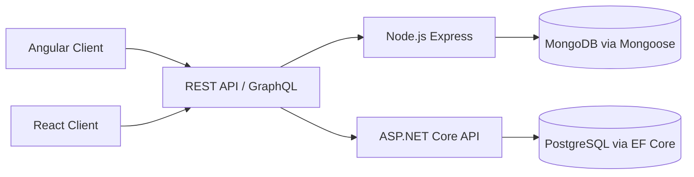
```mermaid
flowchart LR
    AC[Angular Client] --> API[REST API / GraphQL]
    RC[React Client] --> API
    API --> NodeJS[Node.js Express]
    NodeJS --> MDB[(MongoDB via Mongoose)]
    API --> DOTNET[ASP.NET Core API]
    DOTNET --> PG[(PostgreSQL via EF Core)]
```

### Visão de alto nível

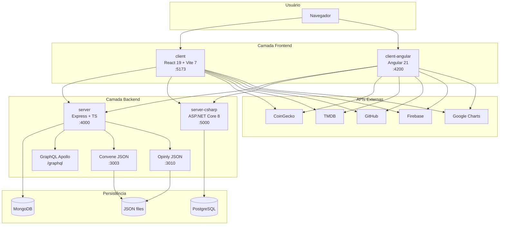
```mermaid
flowchart TB
    subgraph users [Usuário]
        U[Navegador]
    end

    subgraph frontends [Camada Frontend]
        RC["client<br/>React 19 + Vite 7<br/>:5173"]
        AC["client-angular<br/>Angular 21<br/>:4200"]
    end

    subgraph backends [Camada Backend]
        NODE["server<br/>Express + TS<br/>:4000"]
        GQL["GraphQL Apollo<br/>/graphql"]
        CONV["Convene JSON<br/>:3003"]
        OPIN["Opinly JSON<br/>:3010"]
        CS["server-csharp<br/>ASP.NET Core 8<br/>:5000"]
    end

    subgraph storage [Persistência]
        MDB[(MongoDB)]
        PG[(PostgreSQL)]
        JSON[(JSON files)]
    end

    subgraph external [APIs Externas]
        CG[CoinGecko]
        TMDB[TMDB]
        GH[GitHub]
        FB[Firebase]
        GC[Google Charts]
    end

    U --> RC
    U --> AC
    RC --> NODE
    RC --> CS
    AC --> NODE
    AC --> CS
    NODE --> MDB
    NODE --> GQL
    NODE --> CONV
    NODE --> OPIN
    CONV --> JSON
    OPIN --> JSON
    CS --> PG
    RC --> CG
    RC --> TMDB
    RC --> GH
    RC --> FB
    RC --> GC
    AC --> CG
    AC --> TMDB
    AC --> GH
    AC --> FB
    AC --> GC
```

### Deploy local (portas)

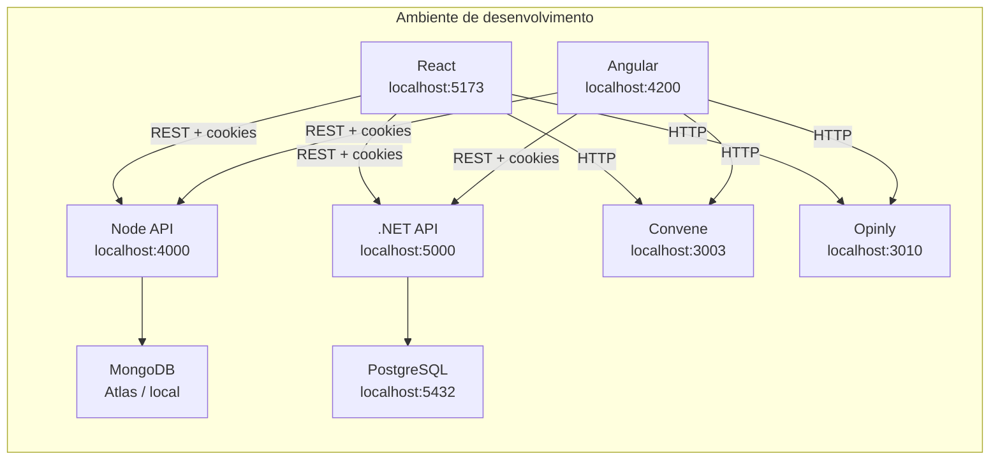
```mermaid
flowchart LR
    subgraph dev [Ambiente de desenvolvimento]
        R["React<br/>localhost:5173"]
        A["Angular<br/>localhost:4200"]
        N["Node API<br/>localhost:4000"]
        D[".NET API<br/>localhost:5000"]
        C["Convene<br/>localhost:3003"]
        O["Opinly<br/>localhost:3010"]
        P["PostgreSQL<br/>localhost:5432"]
        M["MongoDB<br/>Atlas / local"]
    end

    R -->|REST + cookies| N
    R -->|REST + cookies| D
    A -->|REST + cookies| N
    A -->|REST + cookies| D
    R -->|HTTP| C
    R -->|HTTP| O
    A -->|HTTP| C
    A -->|HTTP| O
    N --> M
    D --> P
```

### Fluxo de dados por sistema

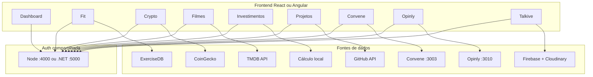
```mermaid
flowchart TB
    subgraph fe [Frontend React ou Angular]
        DASH[Dashboard]
        FIT[Fit]
        CRY[Crypto]
        MOV[Filmes]
        INV[Investimentos]
        PRJ[Projetos]
        CON[Convene]
        OPI[Opinly]
        TAL[Talkive]
    end

    subgraph auth [Auth compartilhada]
        API["Node :4000 ou .NET :5000"]
    end

    subgraph sources [Fontes de dados]
        EXDB[ExerciseDB]
        COIN[CoinGecko]
        TMDB[TMDB API]
        LOCAL[Cálculo local]
        GITHUB[GitHub API]
        JCONV[Convene :3003]
        JOPIN[Opinly :3010]
        FIRE[Firebase + Cloudinary]
    end

    DASH --> API
    FIT --> EXDB
    CRY --> COIN
    MOV --> TMDB
    INV --> LOCAL
    PRJ --> GITHUB
    CON --> JCONV
    OPI --> JOPIN
    TAL --> FIRE
    FIT --> API
    CRY --> API
    MOV --> API
    INV --> API
    PRJ --> API
    CON --> API
    OPI --> API
    TAL --> API
```

### Fluxo de autenticação

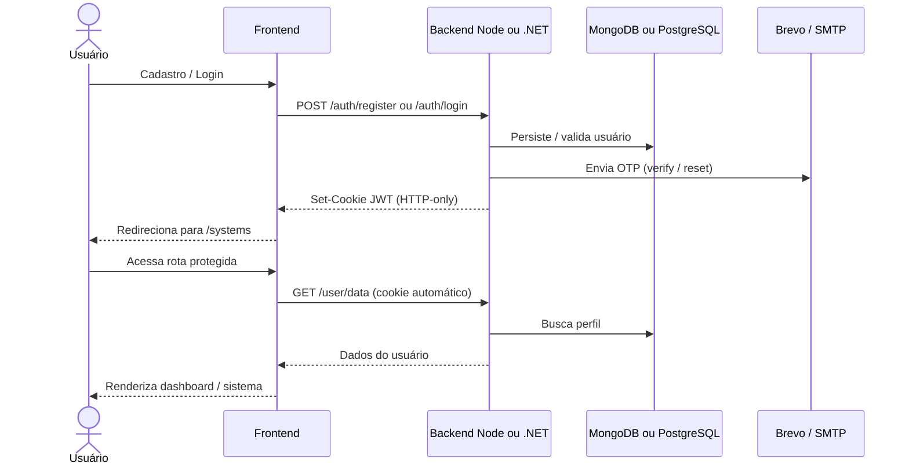
```mermaid
sequenceDiagram
    actor U as Usuário
    participant FE as Frontend
    participant BE as Backend Node ou .NET
    participant DB as MongoDB ou PostgreSQL
    participant SMTP as Brevo / SMTP

    U->>FE: Cadastro / Login
    FE->>BE: POST /auth/register ou /auth/login
    BE->>DB: Persiste / valida usuário
    BE->>SMTP: Envia OTP (verify / reset)
    BE-->>FE: Set-Cookie JWT (HTTP-only)
    FE-->>U: Redireciona para /systems

    U->>FE: Acessa rota protegida
    FE->>BE: GET /user/data (cookie automático)
    BE->>DB: Busca perfil
    BE-->>FE: Dados do usuário
    FE-->>U: Renderiza dashboard / sistema
```

---

## 🗂️ Estrutura do repositório

```txt
reactrack/
├── client/                 # Frontend React 19 + Vite 7 + TypeScript
├── client-angular/         # Frontend Angular 21 (AngularRack)
├── server/                 # Backend Node.js + Express + GraphQL
│   ├── config/             # Conexão MongoDB
│   ├── controllers/        # Auth e User
│   ├── middleware/         # JWT userAuth
│   ├── middlewares/        # Middlewares secundários (Melt)
│   ├── routes/             # auth, user, home, error
│   ├── graphql/            # Apollo Server
│   ├── json/               # Fontes JSON (Convene, Opinly)
│   ├── systems/            # Micro-serviços JSON
│   ├── templates/          # E-mails
│   ├── tests/              # Mocha + Chai + Sinon
│   └── views/              # Home/documentação SSR
├── server-csharp/
│   ├── Communication/      # DTOs (Requests / Responses)
│   ├── Exceptions/         # Exceções de domínio
│   └── ReactRack/          # API, Use Cases, Infrastructure
├── ui-ux/                  # Screenshots e referências visuais
├── docker-compose.yml      # Orquestração multi-stack local
├── README.md               # Este arquivo — documentação principal
├── ECOSSISTEMA_PROJETO.md  # Guia de aprendizado C#/Angular/PostgreSQL
└── ANGULARRACK_SETUP.md    # Setup passo a passo do AngularRack
```

---

## ⚙️ Backend Node.js (Express + TypeScript)

Dois backends implementam o **mesmo contrato de autenticação**. O Node também hospeda GraphQL e micro-serviços JSON.

### Camadas e responsabilidades

| Pasta | Responsabilidade técnica |
|-------|--------------------------|
| `server/config` | Inicialização de conexão MongoDB via Mongoose (`connected`, `disconnected`, `error`) |
| `server/controllers` | Casos HTTP para `auth` e `user`, com assinatura de cookie JWT, validações e integrações SMTP |
| `server/middleware` | Middleware principal de autenticação JWT com dados de usuário em `res.locals` |
| `server/middlewares` | Middlewares secundários de organização do framework Melt |
| `server/routes` | Composição de rotas Express (`auth`, `user`, `home`, `error`) |
| `server/graphql` | Camada Apollo com `context`, `dataSources`, `directives`, `resolvers`, `schema/types`, `schema/models` |
| `server/models` | Schema de usuário (Mongoose) |
| `server/templates` | Templates de e-mail + transporter Brevo/Nodemailer |
| `server/tests` | Testes automatizados (`Mocha`, `Chai`, `Sinon`) |
| `server/json` + `systems/` | Fontes e serviços JSON para Convene (`:3003`) e Opinly (`:3010`) |
| `server/views` | Páginas HTML SSR de home/documentação e fallback de erro |

### Entrypoints e build

- `server.ts`: bootstrap do Express, conexão de banco, integração GraphQL e start da API.
- `app.ts`: instância da aplicação, CORS, prevenção de CSRF e registro de middlewares/rotas.
- `tsup.config.ts`: bundle do servidor (`build-server`) com cópia de assets (`public`, `views`, `graphql`).

### Rotas REST Node

| Arquivo | Endpoints principais |
|---------|---------------------|
| `server/routes/auth.ts` | `/api/auth/register`, `/api/auth/login`, `/api/auth/logout`, `/api/auth/forgot-password` + fluxos OTP/verify |
| `server/routes/user.ts` | `/api/user/data` (protegida) |
| `server/routes/home.ts` | `/` (home/documentação da API) |
| `server/routes/error.ts` | `*` fallback 404 |

### Pipeline de requisição

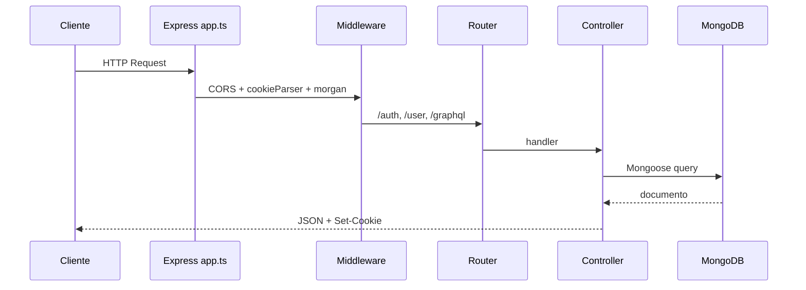
```mermaid
sequenceDiagram
    participant C as Cliente
    participant E as Express app.ts
    participant M as Middleware
    participant R as Router
    participant CT as Controller
    participant DB as MongoDB

    C->>E: HTTP Request
    E->>M: CORS + cookieParser + morgan
    M->>R: /auth, /user, /graphql
    R->>CT: handler
    CT->>DB: Mongoose query
    DB-->>CT: documento
    CT-->>C: JSON + Set-Cookie
```

### GraphQL (backend Node)

Organizado para consultas e mutações com:

- `context/buildContext`
- `dataSources/createDataSources`
- `directives/authDirectiveTransformer`
- `resolvers/mutations`, `resolvers/queries`, `resolvers/scalars`
- `schema/models`, `schema/types`

---

## 🧩 Backend C# (.NET + PostgreSQL)

### Estrutura técnica

| Módulo | Papel arquitetural |
|--------|-------------------|
| `Communication/Requests` | Contratos de entrada tipados (Login, Register, ResetPassword, SendResetOtp, ValidateResetOtp, VerifyAccount) |
| `Communication/Responses` | Contratos de saída tipados para respostas de API/Auth/UserData |
| `Controllers` | Controllers `Auth` e `User` para orquestração dos Use Cases |
| `Entities` | Entidade de usuário persistida pelo EF Core |
| `Filters` | Global Exception Filter para normalização de erros HTTP |
| `Infrastructure` | Email, Middleware de logging, Persistence, Repositories, Security e Settings |
| `Repositories` | Abstrações de acesso a dados via interfaces |
| `Security` | Geração e validação de JWT (Issuer, Audience, SecretKey) |
| `Settings` | Configurações tipadas para JWT e SMTP |
| `UseCases` | Casos de uso por domínio (`Auth`, `User`) |

### Padrões e decisões de engenharia

- **Clean Architecture** para separação entre entrada HTTP, domínio de aplicação e infraestrutura.
- **Repository Pattern** para desacoplamento de persistência.
- **Dependency Injection** nativa do ASP.NET Core para Use Cases, repositórios, serviços de token e e-mail.
- **Global Exception Filter** para padronização de respostas de erro.

### `Program.cs` (pipeline e infraestrutura)

- `WebApplicationBuilder` + `DbContext` com `UseNpgsql`.
- Configuração de `JwtBearer` com validação de `Issuer`, `Audience`, `Lifetime` e `SigningKey`.
- Recuperação de JWT por cookie HTTP-only (`token`) em `OnMessageReceived`.
- `Swagger`/`SwaggerUI` em ambiente de desenvolvimento.
- Política CORS para `localhost:5173` (React) e `localhost:4200` (Angular).
- Logging de request/response via middleware dedicado.

### Use Cases implementados

| Domínio | Use Cases |
|---------|-----------|
| **Auth** | Register, Login, VerifyAccount, SendVerifyOtp, SendResetOtp, ValidateResetOtp, ResetPassword |
| **User** | GetUserData |

### Clean Architecture (diagrama)

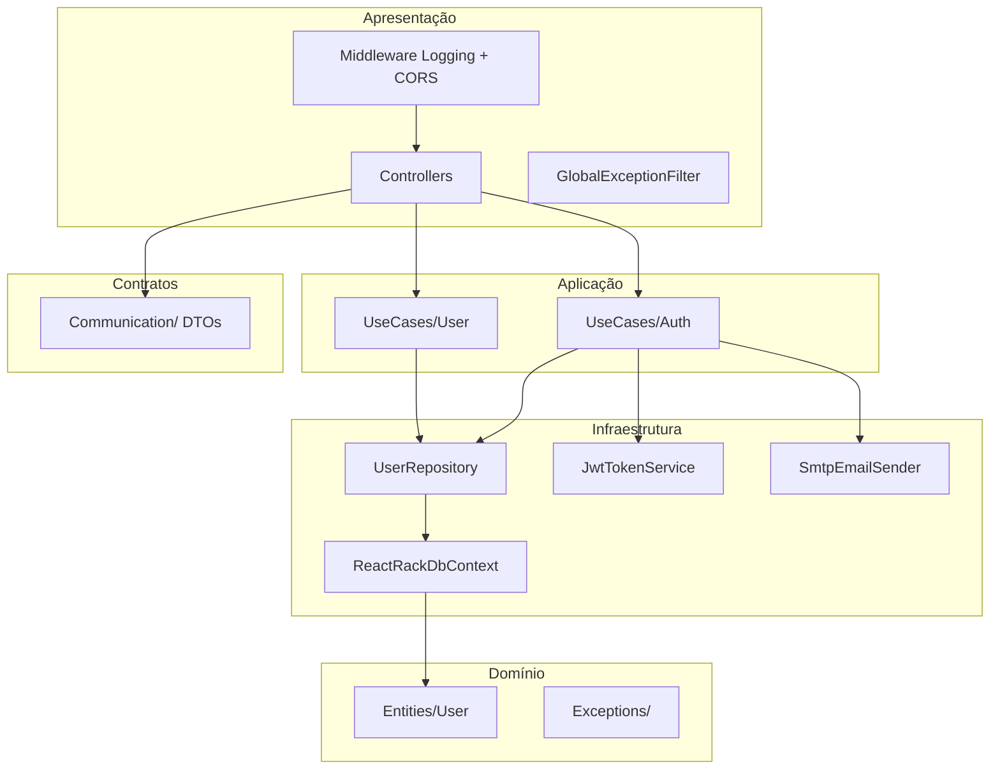
```mermaid
flowchart TB
    subgraph presentation [Apresentação]
        CTRL[Controllers]
        FILT[GlobalExceptionFilter]
        MW[Middleware Logging + CORS]
    end

    subgraph application [Aplicação]
        UC_AUTH[UseCases/Auth]
        UC_USER[UseCases/User]
    end

    subgraph domain [Domínio]
        ENT[Entities/User]
        EXC[Exceptions/]
    end

    subgraph infra [Infraestrutura]
        REPO[UserRepository]
        DB[ReactRackDbContext]
        JWT[JwtTokenService]
        EMAIL[SmtpEmailSender]
    end

    subgraph contracts [Contratos]
        DTO[Communication/ DTOs]
    end

    CTRL --> UC_AUTH
    CTRL --> UC_USER
    UC_AUTH --> REPO
    UC_USER --> REPO
    REPO --> DB
    DB --> ENT
    UC_AUTH --> JWT
    UC_AUTH --> EMAIL
    CTRL --> DTO
    MW --> CTRL
```

### Comparação Node × .NET

| Aspecto | Node (`server/`) | .NET (`server-csharp/`) |
|---------|------------------|-------------------------|
| **Padrão** | MVC + controllers | Clean Architecture (Use Cases) |
| **ORM** | Mongoose | Entity Framework Core |
| **Banco** | MongoDB | PostgreSQL |
| **Auth** | JWT cookie + middleware | JWT cookie + JwtBearer |
| **E-mail** | Nodemailer / Brevo | MailKit / SMTP |
| **Extra** | GraphQL, JSON systems | Swagger, testes xUnit |
| **Porta dev** | 4000 | 5000 |

---

## 🖥️ Frontends (React e Angular)

Os dois frontends seguem a **mesma organização conceitual**: core compartilhado, features por sistema e layout autenticado único.

### React (`client/`)

- **Vite 7 + React 19 + TypeScript**, Tailwind 4, MUI, TanStack Query, React Router 7, Formik/Yup, i18next, Vitest.
- Camada `src/api` com funções para autenticação, verificação de conta, reset de senha e `userData`.
- Integração com contextos de domínio e múltiplos “sistemas” (módulos) na mesma SPA.

**Comandos:** `npm run dev` · `npm run build` · `npm run preview` · `npm run lint` · `npm run test`

```txt
client/src/
├── api/                    # HTTP: auth, verify, reset, userData
├── components/             # Navbar, KeyboardShortcuts, Systems/*
├── constants/              # navigation, keyboard
├── context/                # AppContext, Coin, Opinly, Talkive…
├── hooks/                  # backend, routes, states, keyboard
├── i18n/locales/           # pt.json, en.json
├── pages/                  # Auth, Fit, Crypto, Systems…
├── routes/index.tsx        # createBrowserRouter + lazy loading
├── App.tsx                 # Outlet + ShortcutsModal + providers
└── App.css                 # Scrollbar, Fit, scroll horizontal
```

### Angular (`client-angular/`)

- Frontend alternativo com **Angular 21**.
- Consome a mesma interface REST/JWT usada pelo cliente React.
- Compatível com autenticação por cookie HTTP-only nos backends Node e C#.
- Posicionado para times que adotam ecossistema Angular e DI nativa do framework.

**Comandos:** `npm start` · `npm run build` · `npm run watch`

### Camadas compartilhadas (React + Angular)

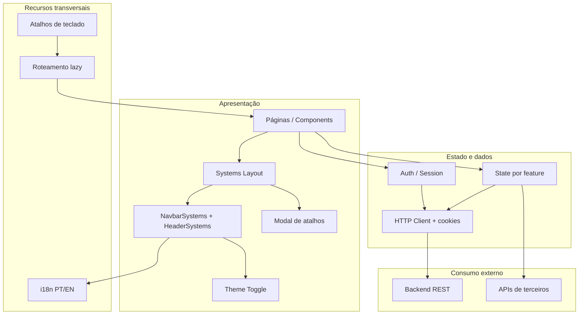
```mermaid
flowchart TB
    subgraph presentation [Apresentação]
        PAGES[Páginas / Components]
        LAYOUT[Systems Layout]
        NAV[NavbarSystems + HeaderSystems]
        MODAL[Modal de atalhos]
        THEME[Theme Toggle]
    end

    subgraph cross [Recursos transversais]
        I18N[i18n PT/EN]
        KEYS[Atalhos de teclado]
        ROUTER[Roteamento lazy]
    end

    subgraph state [Estado e dados]
        AUTH[Auth / Session]
        FEAT[State por feature]
        HTTP[HTTP Client + cookies]
    end

    subgraph external [Consumo externo]
        REST[Backend REST]
        APIS[APIs de terceiros]
    end

    PAGES --> LAYOUT
    LAYOUT --> NAV
    LAYOUT --> MODAL
    NAV --> THEME
    NAV --> I18N
    PAGES --> AUTH
    PAGES --> FEAT
    AUTH --> HTTP
    FEAT --> HTTP
    FEAT --> APIS
    HTTP --> REST
    KEYS --> ROUTER
    ROUTER --> PAGES
```

| Camada | React (`client/`) | Angular (`client-angular/`) |
|--------|-------------------|----------------------------|
| **Core** | `hooks/`, `context/`, `utils/` | `core/services/`, `guards/`, `interceptors/` |
| **Constantes** | `constants/navigation/`, `constants/keyboard/` | `core/constants/navigation/`, `keyboard/` |
| **i18n** | `i18n/` + react-i18next | `I18nService` + `core/constants/i18n/locales/` |
| **Tema** | `ThemeToggle` + `.dark` no `<html>` | `ThemeService` + `ThemeToggleComponent` |
| **Atalhos** | `KeyboardShortcutsContext` | `KeyboardShortcutsService` |
| **Features** | `pages/` por domínio | `features/` por domínio |
| **Layout auth** | `pages/Systems/SystemsLayout` | `layouts/systems-layout/` |
| **Estado feature** | Context API (Coin, Opinly, Talkive…) | Services com signals |

### Mapa de rotas

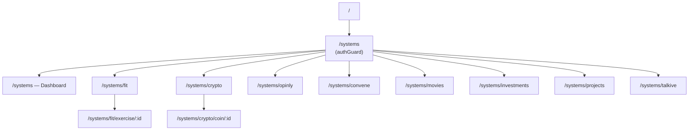
```mermaid
flowchart TD
    ROOT["/"]
    SYS["/systems<br/>(authGuard)"]
    DASH["/systems — Dashboard"]
    FIT["/systems/fit"]
    FITD["/systems/fit/exercise/:id"]
    CRY["/systems/crypto"]
    COIN["/systems/crypto/coin/:id"]
    OPI["/systems/opinly"]
    CON["/systems/convene"]
    MOV["/systems/movies"]
    INV["/systems/investments"]
    PRJ["/systems/projects"]
    TAL["/systems/talkive"]

    ROOT --> SYS
    SYS --> DASH
    SYS --> FIT
    FIT --> FITD
    SYS --> CRY
    CRY --> COIN
    SYS --> OPI
    SYS --> CON
    SYS --> MOV
    SYS --> INV
    SYS --> PRJ
    SYS --> TAL
```

Rotas públicas: `/`, `/login`, `/signup`, `/email-verify`, `/reset-password`.  
Todas em `/systems/*` (exceto dashboard) usam **lazy loading**.

---

## 🧩 Sistemas (módulos de produto)

| # | Sistema | Rota | Fonte de dados | Destaques |
|---|---------|------|----------------|-----------|
| 1 | **Talkive** | `/systems/talkive` | Firebase + Cloudinary | Chat em tempo real, perfil, upload |
| 2 | **Opinly** | `/systems/opinly` | JSON DB (`:3010`) | CRUD de opiniões, votação |
| 3 | **Convene** | `/systems/convene` | JSON DB (`:3003`) | Eventos, busca, CRUD com imagens |
| 4 | **Filmes** | `/systems/movies` | TMDB API | Top filmes, busca inline, detalhes |
| 5 | **Investimentos** | `/systems/investments` | Cálculo local | Google Charts + tabela |
| 6 | **Projetos** | `/systems/projects` | GitHub API | Perfil e repositórios |
| 7 | **Academia (Fit)** | `/systems/fit` | ExerciseDB | Hero, busca, body parts, paginação |
| 8 | **Criptomoedas** | `/systems/crypto` | CoinGecko | Lista, detalhe, gráfico, moeda |

**Paridade React ↔ Angular:** dashboard com `Alt + 1…8`, i18n PT/EN, tema claro/escuro, modal `Shift + ?`, `NavbarSystems` + `HeaderSystems`, layouts por sistema, Google Charts (Investments e Crypto).

---

## 🌍 Recursos transversais (React e Angular)

### Internacionalização (i18n)

Toggle **EN / PT** na navbar. Traduções espelhadas em `client/src/i18n/locales/` e `client-angular/src/app/core/constants/i18n/locales/`.

### Tema claro / escuro

Classe `.dark` no `<html>` + Tailwind `dark:` variants. React: `ThemeToggle` · Angular: `ThemeService` + `ThemeToggleComponent`.

### Atalhos de teclado

| Atalho | Ação |
|--------|------|
| `Shift + ?` | Abrir modal de atalhos |
| `Esc` | Fechar modal |
| `Alt + H` | Ir para home |
| `Alt + L` | Alternar idioma |
| `Alt + T` | Alternar tema |
| `Alt + D` | Ir para o dashboard |
| `Alt + 1…8` | Navegar para cada sistema |

Navegação centralizada em `constants/navigation/systems.ts` (React) e `core/constants/navigation/systems.ts` (Angular).

---

## 🔌 Rotas e interfaces de API

### Fluxo de autenticação compartilhado

| Operação | Endpoint | Descrição |
|----------|----------|-----------|
| `register` | `POST /auth/register` | Criação de conta e início de verificação |
| `login` | `POST /auth/login` | Emissão de JWT com persistência em cookie |
| `logout` | `POST /auth/logout` | Revogação no cliente (remoção de sessão/cookie) |
| `is-auth` | `GET /auth/is-auth` | No backend C#, devolve `success` e `userData` (id, nome, email, estado de verificação) |
| `sendVerifyOtp` | `POST /auth/send-verify-otp` | Reenvio OTP (protegido) |
| `verifyAccount` | `POST /auth/verify-account` | Verificação de conta por OTP |
| `sendResetOtp` | `POST /auth/send-reset-otp` | Recuperação de senha com OTP |
| `validateResetOtp` | `POST /auth/validate-reset-otp` | Valida OTP reset |
| `resetPassword` | `POST /auth/reset-password` | Nova senha |
| `userData` / `GetData` | `GET /user/data` | Retorno de dados da conta autenticada |

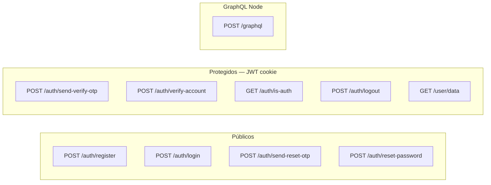
```mermaid
flowchart LR
    subgraph public [Públicos]
        REG[POST /auth/register]
        LOG[POST /auth/login]
        SROTP[POST /auth/send-reset-otp]
        RPWD[POST /auth/reset-password]
    end

    subgraph protected [Protegidos — JWT cookie]
        SVOTP[POST /auth/send-verify-otp]
        VACC[POST /auth/verify-account]
        ISA[GET /auth/is-auth]
        OUT[POST /auth/logout]
        DATA[GET /user/data]
    end

    subgraph gql [GraphQL Node]
        GQL[POST /graphql]
    end
```

### Serviços externos

| Serviço | Sistema | Uso |
|---------|---------|-----|
| CoinGecko | Crypto | Lista, detalhe, histórico |
| TMDB | Filmes | Top filmes, busca, detalhes |
| ExerciseDB | Fit | Exercícios, body parts |
| GitHub API | Projetos | Perfil e repositórios |
| Firebase + Cloudinary | Talkive | Chat e upload |
| Google Charts | Crypto, Investimentos | Gráficos |
| Brevo / SMTP | Auth | E-mails OTP |

---

## 🔐 Variáveis de ambiente

### Node (`server/.env.local` ou `.env`)

```env
PORT=4000
MONGODB_URL=<mongodb-connection-string>
JWT_SECRET=<jwt-secret>
NODE_ENV=development
SMTP_USER=<smtp-user>
SMTP_PASS=<smtp-password>
SENDER_EMAIL=<sender-email>
```

### React (`client/.env.local`)

```env
VITE_BACKEND_URL=http://localhost:4000
```

### Angular (`client-angular/src/environments/environment.ts`)

```typescript
export const environment = {
  production: false,
  backendUrl: 'http://localhost:4000', // ou 5000 para .NET
  firebase: { /* Talkive */ },
  cloudinary: { /* Talkive upload */ },
};
```

### C# (`server-csharp/ReactRack/appsettings.json` e overrides de env)

```json
{
  "Jwt": {
    "SecretKey": "<secret>",
    "Issuer": "ReactRack.Api",
    "Audience": "ReactRack.Client"
  },
  "ConnectionStrings": {
    "Postgres": "Host=localhost;Port=5432;Database=reactrack_db;Username=postgres;Password=123"
  },
  "Smtp": {
    "Host": "smtp-relay.brevo.com",
    "Port": 587,
    "Username": "<user>",
    "Password": "<pass>",
    "FromEmail": "<email>",
    "FromName": "ReactRack",
    "EnableSsl": true
  }
}
```

---

## 🐳 Docker e orquestração local

O `docker-compose.yml` suporta execução simultânea de:

- `server` (Node/Express) em `http://localhost:4000`
- **Convene** (API JSON de eventos) em `http://localhost:3003` e **Opinly** (API JSON de opiniões) em `http://localhost:3010` — serviços expostos no mesmo container do `server` (`npm run dev-server-with-all`)
- `client` (React/Vite) em `http://localhost:5173`
- `server-csharp` (.NET) em `http://localhost:5000`
- `client-angular` (Angular) em `http://localhost:4200` — volume sobrescreve `environment.ts` com `environment.docker.ts`
- `postgres` (backend C#) em `localhost:5432`

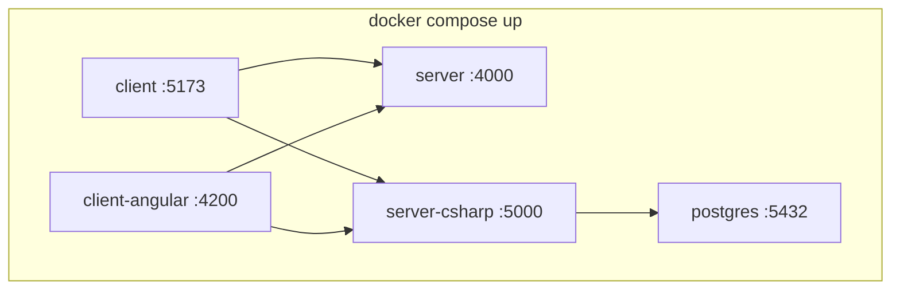
```mermaid
flowchart TB
    subgraph docker [docker compose up]
        REACT_C[client :5173]
        ANG_C[client-angular :4200]
        NODE_C[server :4000]
        DOTNET_C[server-csharp :5000]
        PG_C[postgres :5432]
    end

    REACT_C --> NODE_C
    REACT_C --> DOTNET_C
    ANG_C --> NODE_C
    ANG_C --> DOTNET_C
    DOTNET_C --> PG_C
```

### Comandos

```bash
# Subir todo o ecossistema multi-stack
docker compose up --build

# Subir apenas stack Node + React
docker compose up --build server client

# Subir apenas stack C# + Angular
docker compose up --build postgres server-csharp client-angular
```

No Docker, `client` usa `VITE_BACKEND_URL` apontando para `:4000` (Node) por padrão no compose; ajuste conforme a stack desejada. `client-angular` sobrescreve `environment.ts` via volume para alinhar `backendUrl` ao backend em uso.

---

## 🧪 Scripts e testes

### `client/package.json` (React + Vite)

| Script | Descrição |
|--------|-----------|
| `npm run dev` | Dev server Vite (`vite --host 0.0.0.0`) — porta padrão **5173** |
| `npm run build` | `tsc -b` + `vite build` para produção |
| `npm run preview` | Servir o build localmente |
| `npm run lint` | ESLint no projeto |
| `npm run test` | Vitest em modo `run` |

### `server/package.json` (Node)

| Script | Descrição |
|--------|-----------|
| `npm run dev-server` | Desenvolvimento Node com `nodemon --exec tsx server.ts` |
| `npm run dev-server-with-all` | Node + Convene + Opinly (Docker) |
| `npm run build-server` | Bundle com `tsup` + cópia de assets (`public`, `views`, `graphql`) |
| `npm run server` | Execução de `dist/server.js` com nodemon |
| `npm run test` | Testes automatizados (`Mocha`) |
| `npm run all` | Sobe sistemas JSON (`convene` + `opinly`) com `concurrently` |

### `client-angular/package.json` (Angular)

| Script | Descrição |
|--------|-----------|
| `npm start` | `ng serve --host 0.0.0.0` — porta **4200** |
| `npm run build` | Build de produção Angular |
| `npm run watch` | Build incremental em modo desenvolvimento |

### `server-csharp/ReactRack` (.NET)

| Comando | Descrição |
|---------|-----------|
| `dotnet run` | Sobe API ASP.NET Core — **:5000** |
| `dotnet watch run` | Desenvolvimento com recarga automática |
| `dotnet test ReactRack.sln` | Executa suíte de testes C# (xUnit) |

### `server-csharp/ReactRack.Tests` — cobertura

| Escopo | Cobertura atual |
|--------|-----------------|
| `Auth UseCases` | Register, Login, SendVerifyOtp, VerifyAccount, SendResetOtp, ValidateResetOtp, ResetPassword — cenários de sucesso e falha |
| `User UseCase` | GetUserData — entidade encontrada e não encontrada |
| `Infrastructure` | JwtTokenService (claims/issuer/audience), SmtpEmailSender (validação de entrada) |
| `Cross-cutting` | GlobalExceptionFilter para mapeamento de exceções de domínio |
| **Total atual** | **35 testes aprovados** via `dotnet test ReactRack.sln` |

---

## 🎨 Galeria UI/UX dos sistemas

### 🧱 Server Backend


<hr>

### 📘 Backend HTML


<hr>

### 🧾 JSON Systems


<hr>

### 💻 Client Frontend


<hr>

### 🖼️ UI/UX Frontend


<hr>

### 🏋️ Fit System

#### 🏠 Home


#### 🔎 Search


#### ↔️ Horizontal Scroll


#### 🧠 Muscle Wiki


#### 📚 Exercises


#### 🎯 Exercise


#### 🧬 Same Muscles


#### 🏋️‍♂️ Same Equipment


<hr>

### 🪙 Crypto System

#### 🏠 Home


#### 🔟 Top 10 Coins


#### 📈 Coin Details


<hr>

### 💬 Opinly System

#### 🗄️ Server JSON


#### 🏠 Home


#### 🧠 Opinions


<hr>

### 📅 Convene System

#### 🏠 Home


#### ⏳ Upcoming Events


#### 🔍 Find Events


#### ➕ New Event


#### 🧾 Event Details


#### ✏️ Edit Event


#### 🗑️ Delete Event


<hr>

### 💬 Talkive System

#### 📝 SignUp


#### 🔐 Login


#### 👤 Profile Update


#### ✅ Profile Completed


#### 💬 Chat


#### 🔎 Search


#### 👥 Friends


#### 🧱 ChatBox


#### 📨 Message


#### 📥 Receiving Message


#### 🟢 Online


#### 👀 Message Not Seen


<hr>

### 🎬 Movies System

#### 🏠 Home


#### 🔎 Search


#### 🎞️ Movie Details


<br>


<hr>

### 💹 Investments System

#### 🏠 Home


#### 📊 Table Investments


<hr>

### 🧪 Projects System

#### 🏠 Home


#### 🔎 Search


---

## 📋 ADR — quando escolher cada stack

### Node.js + Express

- Times JavaScript-first que priorizam throughput de prototipação.
- Ecossistema NPM e integração rápida com serviços JSON-centric (Convene, Opinly).
- Menor custo de iteração para APIs com evolução frequente e GraphQL integrado.

### C# + ASP.NET Core

- Contexto enterprise com governança, contratos estritos e observabilidade.
- Necessidade de modelagem relacional e consistência transacional com PostgreSQL.
- Adoção de padrões robustos (Clean Architecture + DI + filtros globais) para manutenção de longo prazo.

### Angular como frontend

- Times com experiência em ecossistemas empresariais/opinados.
- Preferência por arquitetura modular com DI nativa, guards, interceptors e convenções fortes.
- Reuso da mesma API/JWT existente sem necessidade de alterar backend.

### React como frontend

- Ecossistema amplo, TanStack Query, prototipação rápida.
- Ideal para comparar paridade com Angular no mesmo monorepo.

---

## 🤝 Contribuições

1. Faça um **fork** do repositório.
2. Crie uma **branch** de feature ou fix (`feature/nome` ou `fix/nome`).
3. Mantenha **paridade** ao alterar UI compartilhada (React **e** Angular).
4. Garanta **build e testes** locais (`Node` e/ou `.NET`).
5. Abra um **Pull Request** com contexto técnico e evidências de validação (screenshots quando aplicável).

### Boas práticas

- Alterou UI de um sistema? Verifique `client` e `client-angular`.
- Novo endpoint? Atualize este README.
- Estilos globais no Angular: `styles.css` ou `ViewEncapsulation.None` quando necessário.
- Não commitar secrets (`.env`, credenciais).

---

## 📚 Documentação complementar

| Documento | Conteúdo |
|-----------|----------|
| [ECOSSISTEMA_PROJETO.md](./ECOSSISTEMA_PROJETO.md) | Guia de aprendizado: PostgreSQL, EF Core, Angular, fluxo de login |
| [ANGULARRACK_SETUP.md](./ANGULARRACK_SETUP.md) | Setup passo a passo do AngularRack |
| [server/graphql/](./server/graphql/) | Conceitos, integração e exemplos GraphQL |
| [ui-ux/](./ui-ux/) | Screenshots dos sistemas |

---

*Última atualização: junho de 2026 — documentação unificada com arquitetura multi-stack, diagramas frontend/backend, 8 sistemas, paridade React/Angular e guia operacional completo.*
